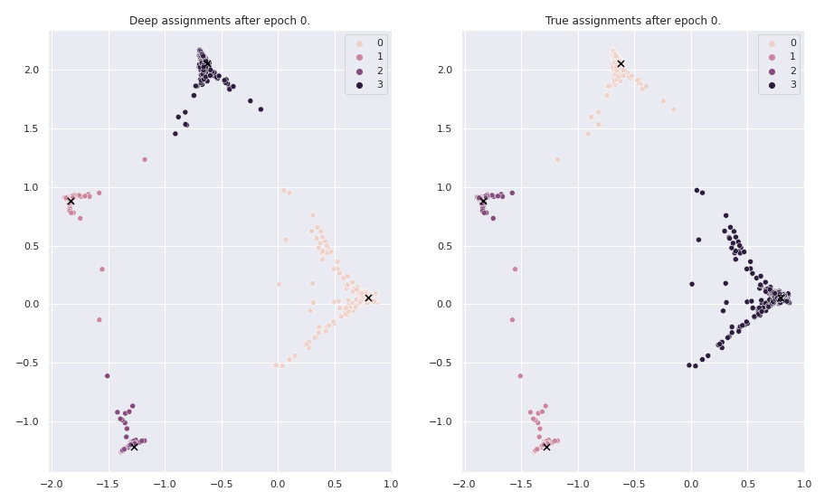

# dcn-deep-clustering-networks

This repository contains an implementation of the clustering approach introduced in "Towards K-means-friendly Spaces:
Simultaneous Deep Learning and Clustering" (http://arxiv.org/abs/1610.04794).

The algorithm uses self-supervised learning with a custom loss function to learn a mapping of the input data (the
observed space) to a k-means friendly latent space.

Through this approach, the k-means algorithm can identify meaningful clusters in data that is hard to cluster in the
observed space (assuming there exist a meaningful and clustering representation).

Note that there exist other implementations of the paper (including an official
one): https://paperswithcode.com/paper/towards-k-means-friendly-spaces-simultaneous

Example
========
The code was tested with python 3.9 and the package versions as indicated in requirements.txt. To run the code, first
make sure all requirements are installed:

```commandline
pip install -r ./requirements.txt
```

After importing the DCN class from DCN.py and given some data X, the latent dimension, number of clusters and
hyperparameter lambda, the model can be run as follows:

```python
from DCN import DCN
import tensorflow as tf

# we assume data X exists already
dcn_model = DCN(latent_dim=2,
                input_dim=X.shape[1],
                n_clusters=4,
                lamda=200  # weight of clustering loss (vs. reconstruction loss)
                )
optimizer = tf.keras.optimizers.Adam(learning_rate=0.0005)
dcn_model.compile(run_eagerly=True,
                  optimizer=optimizer)
dcn_model.pretrain(X,
                   epochs=50,
                   batch_size=64,
                   verbose=True)  # the paper suggests to pretrain the model without considering the clustering loss
dcn_model.fit(X, X,
              shuffle=True,
              batch_size=64,
              epochs=50)
# get cluster results
latent_x = dcn_model.encoder(X)
assignments = dcn_model.get_assignment(latent_x)
```

For a more elaborated description, please refer to the example notebook.

Visualize what happens during training
========================================
The notebook's example is inspired by the motivational example in the original paper, where ten thousand data points from four clearly distinguishable clusters are mapped into a 100-dimensional space where the clusters are not clearly distinguished anymore.
DCN is then trained to find the latent representation and detect clusters accordingly. In our experiments, DCN was able to find meaningful clusters:



The gif shows the latent space and clustering results after 1, 11, 21, 31, 41 epochs of training. Moreover, we applied 50 epochs of pretraining before starting the actual training.
On the left hand side, the labels as identified by DCN are displayed. On the right hand side, the "ground truth" cluster assignments are displayed. We see, that DCN and the ground truth cluster together the same points.
Even though the clustering is reasonable after the first epoch already, DCN creates increasingly k-means-friendlier (lower k-means cluster loss) representations. 